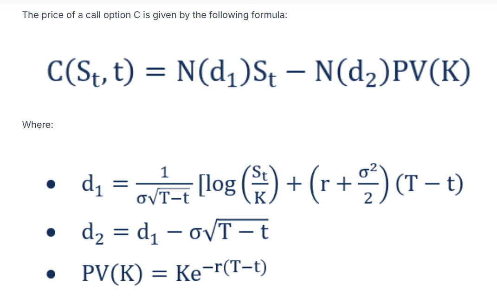

# 📊 Option Pricing Models Web Application

A **Streamlit-based web application** designed to provide comprehensive tools for option pricing using three of the most widely recognized models in quantitative finance:

1. **Black-Scholes Model**
2. **Binomial Options Pricing Model**
3. **Monte Carlo Simulation**

This application is ideal for financial analysts, traders, and students interested in understanding and visualizing option pricing theories.

---

## 📒 Table of Contents

1. [Features](#-features)
2. [Technology Stack](#-technology-stack)
3. [Installation](#-installation)
4. [Usage](#-usage)
5. [Application Structure](#-application-structure)
6. [Option Pricing Models Overview](#-option-pricing-models-overview)
7. [Screenshots](#-screenshots)
8. [Contributing](#-contributing)
9. [Contact](#-contact)

---

## 🌟 Features

- **Interactive UI**: User-friendly interface for inputting parameters and switching between models.
- **Dynamic Visualization**: Heatmaps for visualizing the effect of stock price and volatility on option pricing.
- **Multi-Model Navigation**: Seamless switching between Black-Scholes, Binomial, and Monte Carlo models.
- **Custom Configurations**: Adjust model parameters like volatility, interest rate, and time to maturity.
- **Real-Time Calculations**: Instant display of calculated option prices and profitability.

---

## 🛠️ Technology Stack

- **Python**: Core programming language.
- **Streamlit**: Web framework for building the interactive UI.
- **NumPy**: For numerical computations.
- **SciPy**: Statistical functions used in the Black-Scholes model.
- **Matplotlib**: For heatmap visualizations.

---

## 📦 Installation

1. **Clone the Repository**

```bash
git clone https://github.com/sahithi-sss/option-pricing-models.git
cd option-pricing-models
```

2. **Create a Virtual Environment (Optional but Recommended)**

```bash
python -m venv venv
source venv/bin/activate  # On Windows use: venv\Scripts\activate
```

3. **Install Required Packages**

```bash
pip install -r requirements.txt
```

4. **Run the Application**

```bash
streamlit run app.py
```

---

## 🔍 Usage

1. Launch the application using the command above.
2. Use the **sidebar** to select between models:
   - **Black-Scholes Model**
   - **Binomial Options Pricing Model**
   - **Monte Carlo Simulation**
3. Input relevant parameters:
   - Current Stock Price (S)
   - Strike Price (K)
   - Time to Maturity (T)
   - Risk-Free Interest Rate (r)
   - Volatility (σ)
4. View calculated option price and heatmap visualizations.
5. Use the navigation sidebar to switch between models.

---

## 🔄 Application Structure

```plaintext
option-pricing-models/
|│
|├── app.py                        # Main application file
|├── pages/
|│   |├── 1_black-scholes-model.py     # Black-Scholes model implementation
|│   |├── 2_binomial-model.py           # Binomial options pricing model
|│   └── 3_monte-carlo-model.py        # Monte Carlo simulation model
|├── images/                      # Images used in the application
|├── requirements.txt              # Python dependencies
└── README.md                    # Project documentation
```

---

## 📈 Option Pricing Models Overview

### 1. **Black-Scholes Model**
The Black-Scholes model is a mathematical model for pricing European call and put options. It assumes constant volatility and risk-free rates, with no dividends.

- **Assumptions:**
  - Lognormal distribution of stock prices
  - No dividends paid during the option's life
  - Options can only be exercised at expiration
  - No transaction costs or taxes
  - Constant risk-free interest rate

### 2. **Binomial Options Pricing Model**
The Binomial model provides a flexible method for option pricing by simulating potential price movements over discrete time intervals.

- **Assumptions:**
  - Stock prices move in a series of discrete steps (up or down)
  - Risk-neutral valuation applied
  - Can price both European and American options

### 3. **Monte Carlo Simulation**
Monte Carlo methods rely on simulating multiple random price paths for the underlying asset and averaging the discounted payoff.

- **Assumptions:**
  - Stock prices follow a stochastic process (often Geometric Brownian Motion)
  - Risk-neutral valuation applied
  - Suitable for complex derivatives

---

## 📸 Screenshots

### Black-Scholes Model


### Binomial Options Pricing Model


### Monte Carlo Simulation


---

## 💪 Contributing

Contributions are welcome! Please follow these steps:

1. Fork the repository.
2. Create a new branch (`git checkout -b feature-branch`).
3. Make your changes.
4. Commit your changes (`git commit -m 'Add new feature'`).
5. Push to the branch (`git push origin feature-branch`).
6. Create a Pull Request.

---

## 📧 Contact

**Sri Sahithi Sunkaranam**  
[LinkedIn](https://www.linkedin.com/in/sri-sahithi-sunkaranam) | [GitHub](https://github.com/sahithi-sss)

---

> This application is designed for educational purposes and should not be used for actual financial trading or investment decisions.
